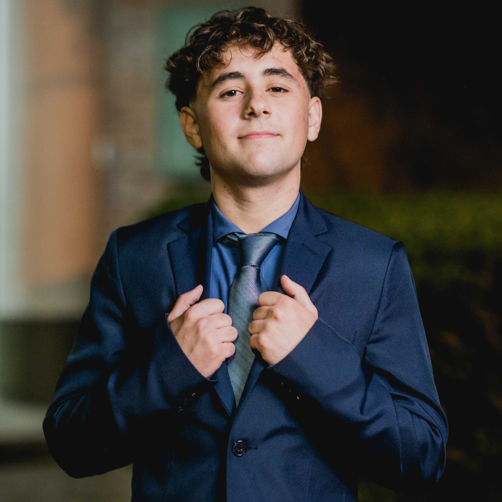

    

<h1 align="center">Hey 👋, I'm Luca Di Bene</h1>
<h1>About me:</h1>
<b>I'm a web developer with a focus on frontend development. I enjoy building interactive and visually appealing interfaces that enhance user experience.
 
Lately, I've been exploring backend development, learning Express.js and PostgreSQL to better understand how the frontend connects with databases and APIs.
 
I'm a self-taught and organized person with strong problem-solving skills, which has helped me learn quickly. Right now, I'm improving my skills in HTML, CSS, JavaScript, and React to create modern and efficient projects.</b>

<h1>Technologies</h1>

<h1>Still learning...</h1>

